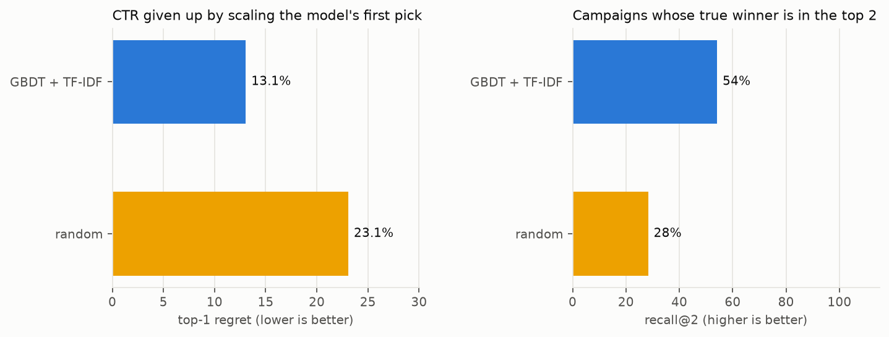
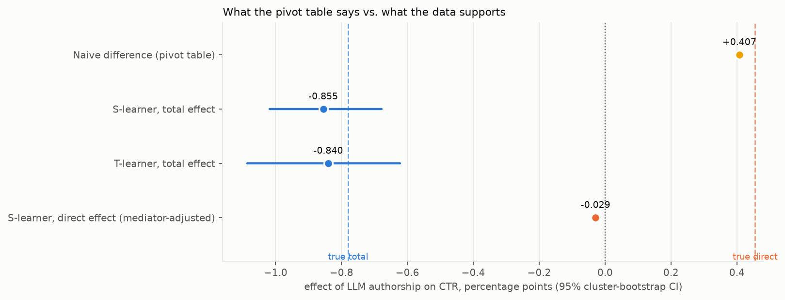
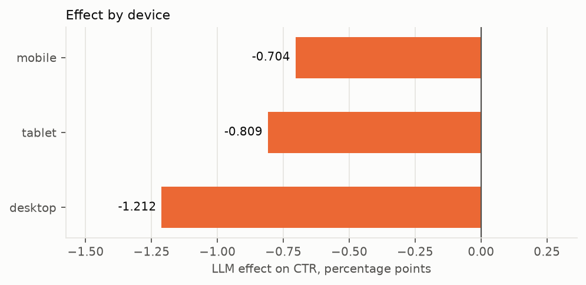

# AdLift report

Account: 943 creatives across 120 campaigns. Model backend: `baseline`.

## Decision summary

- **Cold start.** Ranking new creatives with `GBDT + TF-IDF` before they serve gives up 13.1% of the best achievable CTR, against 23.1% for picking at random. Testing only its top 2 keeps the true winner 54% of the time and leaves 72% of the exploration budget unspent.
- **Human vs LLM copy.** Handing the brief to an LLM hurts CTR by -0.855 pp (95% CI -1.018 pp to -0.678 pp). The pivot-table answer was +0.407 pp, the wrong sign. This estimate passes its checks.
- **Where the effect lives.** 97% of it runs through attributes you can see and control: copy length, whether it carries a number, tone. That is the rewrite policy: let the model polish wording inside those limits.

## Cold-start benchmark

Held-out campaigns, never held-out rows. Each fold fits on the other campaigns and ranks the creatives in campaigns it has never seen.

| Model         |   Spearman |   Top-1 regret |   Recall@2 |   Exploration saved@2 |   Fit s |
|:--------------|-----------:|---------------:|-----------:|----------------------:|--------:|
| GBDT + TF-IDF |     0.6546 |         0.1306 |     0.5417 |                0.7153 |     1.7 |
| random        |     0.0323 |         0.2309 |     0.2833 |                0.7153 |     0   |

## Causal estimate

| Estimate | Value | 95% CI | Adjustment |
|---|---|---|---|
| Naive difference | +0.407 pp | – | none |
| S-learner total | -0.855 pp | -1.018 pp to -0.678 pp | confounders |
| T-learner total | -0.840 pp | -1.086 pp to -0.623 pp | confounders |
| S-learner direct | -0.029 pp | -0.040 pp to -0.020 pp | confounders + creative attributes |
| **Planted truth, total** | **-0.780 pp** | – | – |
| **Planted truth, direct** | **+0.455 pp** | – | – |

### Checks

- Estimators agree: **yes** (S-learner -0.855 pp, T-learner -0.840 pp).
- Placebo: shuffling the author label inside campaigns gives a mean effect of +0.047 pp; the real estimate is 18.2x larger.
- Overlap on the confounder set: author is predictable with AUC 0.65; 0.1% of rows fall outside common support. The total effect is identifiable from this data.
- The direct (mediator-adjusted) estimate conditions on copy attributes that the author determines. LLM copy is systematically longer and less numeric, so the two arms barely overlap on those columns and the direct effect is poorly identified. It is reported for the mediation split, not as a headline.

## Effect by segment

| device   |   effect |      sd |   n |
|:---------|---------:|--------:|----:|
| mobile   | -0.00704 | 0.00904 | 594 |
| tablet   | -0.00809 | 0.00847 |  86 |
| desktop  | -0.01212 | 0.00977 | 263 |

## Method

- **Model.** TabPFN 3.5 through `tabpfn-client` reads the creative text directly; no vectoriser. Fitting is in-context, so each fold and each rewrite is seconds.
- **Splits.** `GroupKFold` on campaign. Rows in one campaign share budget, audience and an unobserved quality; splitting rows would leak.
- **Effect.** S-learner: one model on confounders + author, every row scored under both authors. T-learner: one model per author, cross-predicted. Intervals: cluster bootstrap over campaigns.
- **Adjustment set.** Placement, device, vertical, audience, budget, week. Creative attributes are mediators and are excluded from the confounder set on purpose.
- **Related work.** Do-PFN (Robertson et al., 2025) uses these meta-learners as baselines and its 'Confounder + Mediator' case study is this problem's graph. Drift-Resilient TabPFN addresses the rising LLM adoption over time that confounds the naive comparison.