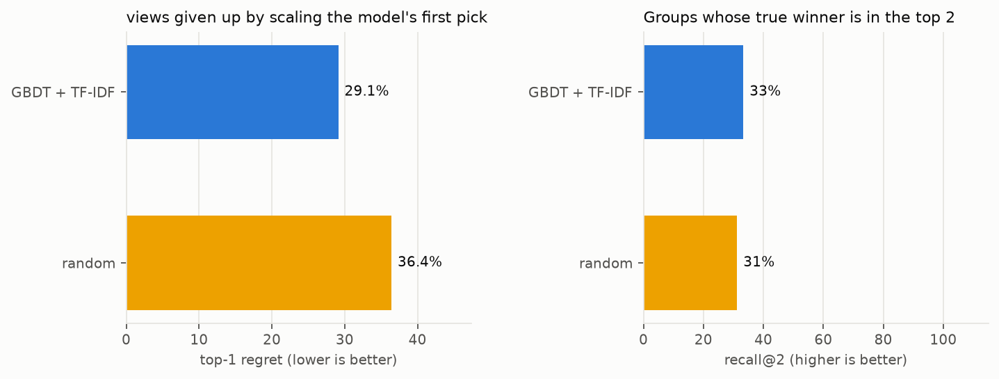
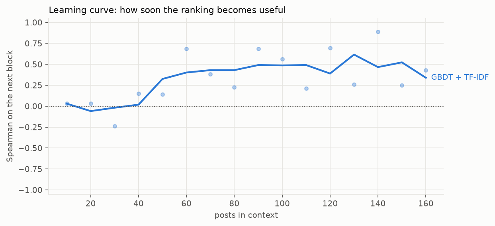
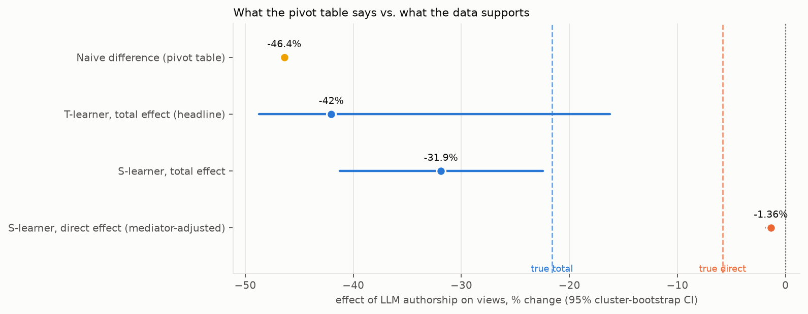
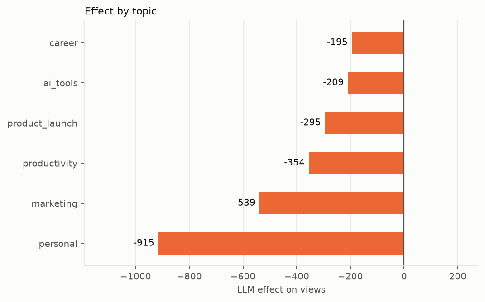
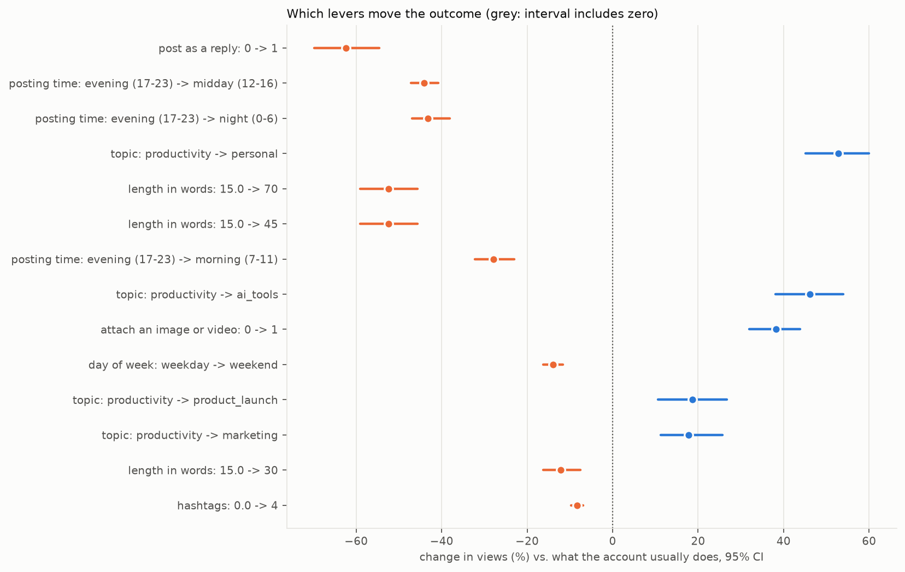

# AdLift report
Dataset: `threads`. 171 rows across 16 weeks. Outcome: **views**. Model backend: `baseline`.
## Decision summary
- **Cold start.** Ranking new rows with `GBDT + TF-IDF` before they run gives up 29.1% of the best achievable views, against 36.4% for picking at random. Testing only its top 2 keeps the true winner 33% of the time and leaves 81% of the exploration budget unspent.
- **Human vs LLM copy.** Handing the brief to an LLM hurts views by -42.0% (-402.7 views) (95% CI -48.7% to -16.3%). The pivot-table answer was -46.4% (-389.2 views). This estimate passes its checks.
- **Where the effect lives.** 96% of it runs through attributes you can see and control: length, whether it carries a number, tone, hashtags. That is the rewrite policy: let the model polish wording inside those limits.
- **Biggest lever.** post as a reply: 0 -> 1 changes views by -62.4% (-437.1 views) (interval excludes zero).
## Cold-start benchmark
Held-out weeks, never held-out rows, in time order: each fold fits on the past and ranks the next block.
| Model         |   Spearman |   Top-1 regret |   Recall@2 |   Exploration saved@2 |   Fit s |
|:--------------|-----------:|---------------:|-----------:|----------------------:|--------:|
| GBDT + TF-IDF |     0.5004 |         0.2912 |     0.3333 |                0.8083 |    0.71 |
| random        |     0.0943 |         0.3642 |     0.3125 |                0.808  |    0    |

### Learning curve
Rows in time order. The model sees the first *n*, ranks the next block, and the block joins the context. Where a line first stays above zero is where the account can start trusting the ranking.

## Causal estimate: LLM vs human copy

| Estimate | Value | 95% CI | Adjustment |
|---|---|---|---|
| Naive difference | -46.4% (-389.2 views) | – | none |
| T-learner total (headline) | -42.0% (-402.7 views) | -48.7% to -16.3% | confounders |
| S-learner total | -31.9% (-312.9 views) | -41.2% to -22.4% | confounders |
| S-learner direct | -1.4% (-11.0 views) | -1.8% to -1.0% | confounders + creative attributes |
| **Planted truth, total** | **-21.6% (-160.5 views)** | – | – |
| **Planted truth, direct** | **-5.8% (-41.9 views)** | – | – |
### Checks
- Estimators agree: **yes** (T-learner -42.0% (-402.7 views), S-learner -31.9% (-312.9 views)). On small, heavy-tailed data the S-learner shrinks a weak treatment toward zero, so the T-learner is the headline and its interval comes from a bootstrap that refits both arms.
- Median per-row effect: -139.6 views. When the mean and the median disagree in sign, a few outliers are carrying the mean; read the ratio.
- Placebo: shuffling the author label inside each week gives a mean effect of +44.16 views; the real estimate is 7.1x larger.
- Overlap on the confounder set: author is predictable with AUC 0.48; 5.8% of rows fall outside common support. The total effect is identifiable from this data.
- Smallest effect this sample could resolve: about +28% (73 LLM rows, 98 human rows). An estimate inside that band is a statement about the sample, not about the copy.
- The direct (mediator-adjusted) estimate conditions on attributes the author determines. LLM copy is systematically longer and shaped differently, so the two arms barely overlap on those columns and the direct effect is poorly identified. It is reported for the mediation split, not as a headline.
## Effect by segment

| topic          |   effect |       sd |   n |
|:---------------|---------:|---------:|----:|
| career         | -194.59  |  399.863 |  30 |
| ai_tools       | -209.284 |  551.791 |  25 |
| product_launch | -294.656 |  875.552 |  26 |
| productivity   | -354.357 |  850.11  |  38 |
| marketing      | -538.609 | 1140.02  |  29 |
| personal       | -914.792 | 2134.94  |  23 |
## Levers: what to change to make the next one land
Every post re-scored under each alternative setting of one lever, relative to what the account usually does. Model-based counterfactuals, not experiments; `support` is how many rows were actually observed at the alternative.

| lever                    | from            | to             |    effect |   change_pct |    ci_low |   ci_high |   support | significant   |
|:-------------------------|:----------------|:---------------|----------:|-------------:|----------:|----------:|----------:|:--------------|
| post as a reply          | 0               | 1              | -437.148  |        -62.4 | -630.924  | -294.749  |        32 | True          |
| posting time             | evening (17-23) | midday (12-16) | -317.211  |        -44.1 | -402.525  | -239.919  |        25 | True          |
| posting time             | evening (17-23) | night (0-6)    | -305.096  |        -43.2 | -394.98   | -214.068  |         4 | True          |
| topic                    | productivity    | personal       |  252.862  |         52.8 |  176.315  |  368.538  |        23 | True          |
| length in words          | 15.0            | 70             | -248.829  |        -52.4 | -303.365  | -193.404  |         0 | True          |
| length in words          | 15.0            | 45             | -248.829  |        -52.4 | -303.365  | -193.404  |         0 | True          |
| posting time             | evening (17-23) | morning (7-11) | -198.498  |        -27.9 | -290.806  | -131.188  |        32 | True          |
| topic                    | productivity    | ai_tools       |  175.755  |         46.1 |  142.177  |  209.74   |        25 | True          |
| attach an image or video | 0               | 1              |  171.695  |         38.2 |   89.4741 |  250.589  |        69 | True          |
| day of week              | weekday         | weekend        |  -93.6552 |        -14   | -121.534  |  -63.9703 |        28 | True          |
| topic                    | productivity    | product_launch |   92.2745 |         18.6 |   47.0435 |  150.328  |        26 | True          |
| topic                    | productivity    | marketing      |   72.6431 |         17.8 |   25.9712 |  119.615  |        29 | True          |
| length in words          | 15.0            | 30             |  -66.0128 |        -12.2 |  -92.3795 |  -41.4519 |        56 | True          |
| hashtags                 | 0.0             | 4              |  -61.1743 |         -8.3 |  -86.0293 |  -42.4072 |        52 | True          |
| topic                    | productivity    | career         |   57.3765 |         19.1 |   26.0462 |   92.5831 |        30 | True          |
| include a link           | 0               | 1              |  -34.3808 |         -5.1 |  -46.1503 |  -25.1297 |        34 | True          |
| add a call to action     | 0               | 1              |  -13.274  |         -2   |  -26.788  |   -1.598  |        41 | True          |
| LLM instead of human     | human           | llm            |  -10.975  |         -1.4 |  -16.1321 |   -7.0069 |        73 | True          |
| include a number         | 0               | 1              |   -4.0544 |         -1.3 |   -9.0874 |   -0.4383 |        60 | True          |
| open with a question     | 0               | 1              |   -0.6594 |          0.2 |   -2.1934 |    0.5613 |        14 | False         |
| hashtags                 | 0.0             | 2              |    0      |          0   |    0      |    0      |        60 | False         |
| use an emoji             | 0               | 1              |    0      |          0   |    0      |    0      |        73 | False         |
## Method
- **Model.** TabPFN 3.5 through `tabpfn-client` reads the text directly; no vectoriser. Fitting is in-context with `fit_with_cache`, so each fold and each rewrite is seconds and repeated predictions skip the forward pass.
- **Splits.** Held-out weeks. Rows in one week share an audience and an unobserved state; splitting rows would leak. Social timelines use a temporal split.
- **Effect.** Headline: T-learner (one model per author, cross-predicted), interval from a cluster bootstrap that refits both arms. Cross-check: S-learner (one model on confounders + author, each row scored under both). A doubly-robust (AIPW) estimator is in the library but is unstable below a few hundred rows on heavy-tailed outcomes, so it is not reported by default. T-learner: one model per author, cross-predicted. Intervals: cluster bootstrap over weeks. Log-scale outcomes are reported as ratios.
- **Adjustment set.** Context columns only. Creative attributes are mediators and are excluded from the confounder set on purpose.
- **Related work.** Do-PFN (Robertson et al., 2025) uses these meta-learners as baselines and its 'Confounder + Mediator' case study is this problem's graph. Drift-Resilient TabPFN addresses the rising LLM adoption over time that confounds the naive comparison.